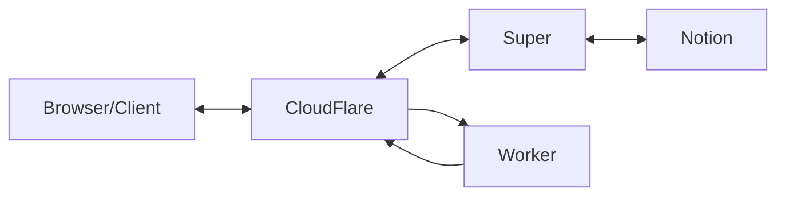
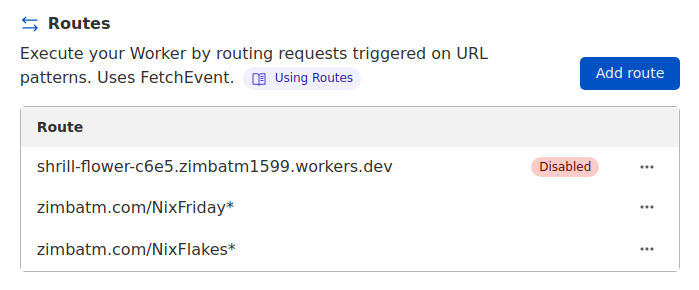

Somebody asked me how this website was set up. So here it is 🙂

Before we jump in, here is a table of all the costs associated with this configuration.

### Costs

- [Domain](https://namecheap.com/): 74 cents per month for me.
- [Notion](https://notion.so/): free, or $4 per month.
- [Super](https://super.so/): $12 per month.
- [Cloudflare](https://cloudflare.com/): free.

## How it works



### Notion

Notion is a wiki-like SaaS. That is where the content of the site is stored. In principle, I prefer to use open-source software to hack on it, but there is also value in having access to a system that is maintained and improved over time. Since I am already using it daily to take journalling notes, it makes it easy to swap the content around. This very article was first written in my journal. Notion itself allows you to publish pages from their content, but it’s only available at `<workspace>.notion.site/<page-name>-<page-id>`

[https://www.notion.so/](https://www.notion.so/)

### Super

That’s where **Super** comes in. It’s straightforward to set up and bind a published notion page to a domain, with some bells and whistles on top. For example, the CSS can get tweaked, add some privacy-preserving analytics, change the menu a bit.

[https://super.so/](https://super.so/)

### Cloudflare

One feature that both Super and Notion are missing is page redirects. Since this website had existing content and links pointing from the outside, I wanted to redirect the users to the new URLs. And I knew that with Cloudflare, it’s possible to intercept the traffic.

1. Register for Cloudflare
1. Import the existing DNS records
1. Change the NS records at Namecheap to point to Cloudflare
1. Point the naked domain to `<site-name>.super.so`
   [https://www.cloudflare.com/](https://www.cloudflare.com/)

### Cloudflare workers

Now that Cloudflare is in front, it’s possible to use their Worker feature to handle redirects. Once you’ve created a service, here is a little worker script that I wrote:

```javascript
addEventListener("fetch", (event) => {
  event.respondWith(handleRequest(event.request));
});

const locationMap = {
  // Put your own routes here
  "/NixFriday": "/old-projects/nixfriday",
  "/NixFlakes": "/notes/nixflakes",
};

async function handleRequest(request) {
  const url = new URL(request.url);

  for (const key in locationMap) {
    // if the path as the 'key' prefix
    if (url.pathname.lastIndexOf(key, 0) == 0) {
      // redirect the user to locationURL
      const locationURL = locationMap[key];
      let headers = new Headers();
      headers.set("Location", locationURL);
      return new Response("The page moved to " + locationURL, {
        status: 302,
        statusText: "Found",
        headers: headers,
      });
    }
  }

  return new Response("This path doesn't match anything: " + url.pathname, {
    status: 500,
    statusText: "Server Error",
  });
}
```

And then attach the routes that need to be redirected to the worker:



## What’s missing

RSS feeds. That isn’t very pleasant, and I hope to solve it in the future.

Some syntax colouring. Nix syntax is supported, but not Terraform or TOML.

The MermaidJS block isn’t supported yet. This is a general issue where super has to keep up with notion changes, and the website could be in a broken state in the meantime.

No backup and restore. Their API allows exporting every page to Markdown so somebody can build a service on top.

## Conclusion

My previous setup was a more classic one; a Git repository rendered to GitHub Pages. It had all the features that I wanted, except a minor issue; I wasn’t writing articles. Editing, remembering the syntax, previewing, thinking about an appropriate commit message, ... Somehow, the friction was preventing me from writing.

This new setup is far from ideal, but my bet seems to be paying off so far; Notion has less friction as the content gets published directly.

That’s it! Let me know if any details are unclear.
